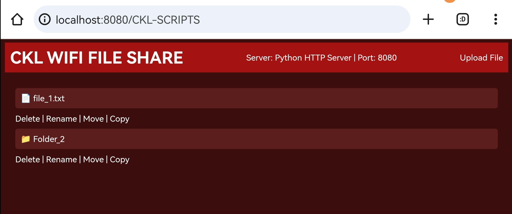

# CKL-SCRIPTS 🎉

Welcome to **CKL-SCRIPTS** 👾, a collection of fun and useful scripts for ethical hacking, file management, and much more! This repository contains a variety of scripts designed to make tasks easier, boost productivity, and add a bit of fun to your coding experience.

## 🛠️ Overview

### CKL WiFi File Share
This script sets up a simple, customizable local file-sharing server. It allows users to upload, download, manage, and organize files and directories over a WiFi connection, all through a web browser.

#### Screenshot:


### Key Features:
- **📤 File Upload & Download**: Easily upload and download files via the web interface.
- **🗂️ File Management**: Delete, rename, move, copy, and create files or directories.
- **🎨 Customizable Interface**: Modify the script to fit your specific needs, including adding access control and more.
- **⚡ Minimal Setup**: Run with minimal dependencies, just run the script and start managing files.

### Advanced Features (Optional Enhancements):
You can further enhance the script by adding:
- **🔐 User Authentication**: Secure the server with login functionality.
- **🖼️ File Previews**: Allow users to preview images, documents, and videos.
- **🛡️ Encryption**: Implement file encryption for secure transfers.
- **🔌 API Integration**: Add integrations with cloud storage or other external services.
- **📱 Mobile Compatibility**: Customize the interface for optimal mobile usage.

## 📥 How to Use:

1. **Clone the repository** to your local machine:

    ```bash
    git clone https://github.com/Chanuka-KL/CKL-SCRIPTS.git
    cd CKL-SCRIPTS
    ```

2. **Run the file-sharing script:**

    ```bash
    python WIFI-FILE-SHARE.PY
    ```

3. **Access the file server** from your browser by visiting:

    ```
    http://<your_device_ip>:8080
    ```

## 📋 Requirements
- Python 3.x
- No additional dependencies are required

## 📜 License
This project is open-source and available under the [MIT License](LICENSE).

## 📧 Contact
Feel free to open issues or submit pull requests. For any questions, contact me via email at [chanuka.dev.kl@gmail.com](mailto:chanuka.dev.kl@gmail.com) or visit my [GitHub Profile](https://github.com/Chanuka-KL).

---

Enjoy exploring and using **CKL-SCRIPTS**! 🚀
